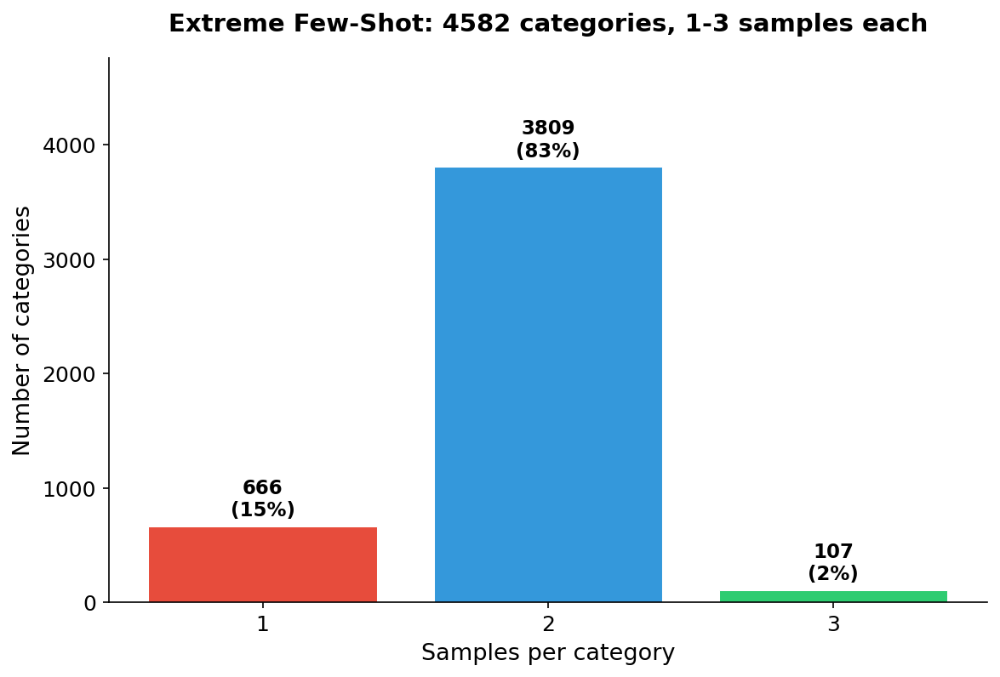
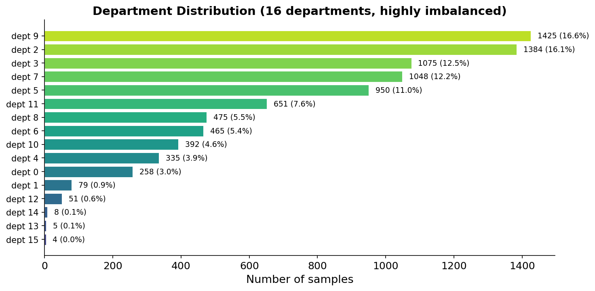
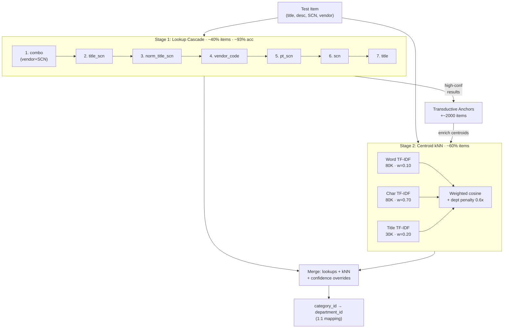
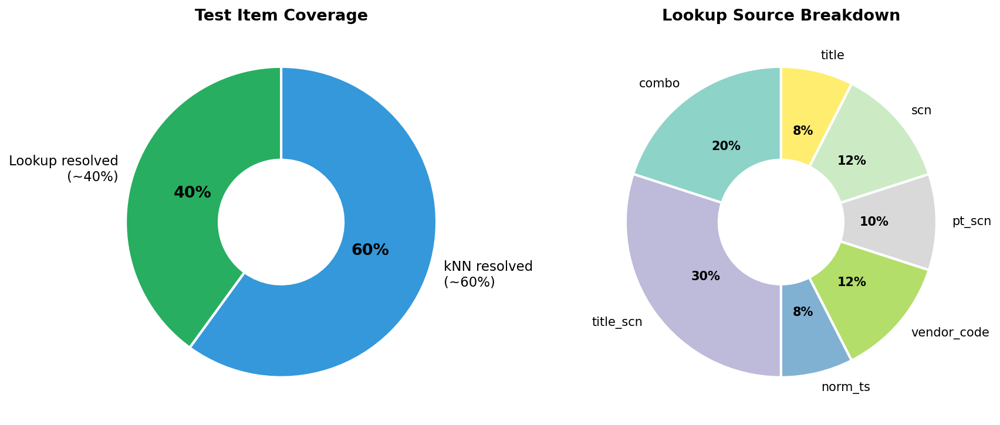
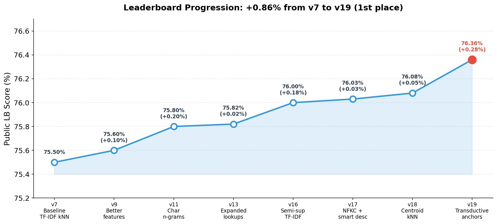

# BDiMO 2026 — 1st Place Solution

**Multi-output product classification** | Public LB: **76.36%** | **1st place**

Решение задачи классификации товаров по `category_id` (4582 класса) и `department_id` (16 классов) на олимпиаде NTO BDiMO 2026.

### TL;DR

> **4582 категории, по 1-3 примера на каждую** — классические классификаторы не тянут.
>
> Наш подход: **Lookup cascade** (exact-match словари) покрывает ~40% данных с ~93% accuracy.
> Остальные ~60% предсказывает **centroid kNN** с 3-канальным TF-IDF (char n-grams доминируют).
> Ключевые трюки: **semi-supervised TF-IDF** (fit на train+test) и **transductive anchors** (уверенные предсказания feedback-ятся в kNN индекс).
>
> Весь pipeline — scikit-learn, без GPU, укладывается в 2 GB RAM и 5 минут.

---

## Задача

Дано: текстовые описания товаров (title, description, shop_category_name, vendor_name, vendor_code).
Нужно: предсказать `category_id` и `department_id`.
Метрика: `(category_accuracy + department_accuracy) / 2`.

**Constraints:** Docker (2 CPU, 2 GB RAM, 10 мин, no GPU, 100 MB repo).

---

## Dataset



| Свойство | Значение |
|----------|----------|
| Training samples | 8605 |
| Unique categories | 4582 |
| Unique departments | 16 |
| Samples per category | 1-3 (83% имеют ровно 2) |
| Categories с 1 sample | 666 (14.5%) |
| shop_category_name = "-" | ~20% строк (бесполезно) |
| Missing vendor_code | 40.5% |

Это задача **extreme few-shot classification**: тысячи классов, по 1-3 примера на каждый. Классические классификаторы (SVM, Ridge) показывают 54-64% — для них слишком мало данных на класс.



---

## Key Insight #1: category -> department это 1:1 mapping

Каждый `category_id` принадлежит ровно одному `department_id`. Поэтому задача multi-output сводится к single-output: предсказываем только `category_id`, а `department_id` берём из маппинга.

## Key Insight #2: Lookups before ML

42% значений `shop_category_name` однозначно маппятся на одну категорию. Добавив другие комбинации полей, мы покрываем **~40% тестовых данных** с ~93% точностью — вообще без ML.

---

## Pipeline



### Stage 1: Lookup Cascade (~40% items, ~93% accuracy)

Строим детерминированные словари из обучающих данных. Каждый маппит комбинацию полей на `category_id`, но только когда маппинг **однозначный** (все примеры дают одну категорию).

Проверяем по приоритету (первое совпадение побеждает):

| # | Lookup Key | Размер | Идея |
|---|-----------|--------|------|
| 1 | `(vendor_name, shop_category_name)` | 429 | Самый надёжный: конкретный бренд + категория магазина. Требуем >= 2 примера |
| 2 | `(title, shop_category_name)` | 7706 | Точное совпадение title + SCN |
| 3 | `(normalized_title, shop_category_name)` | 7627 | Title без чисел/размеров + SCN (ловит варианты типа "100мл" vs "200мл") |
| 4 | `vendor_code` | 4969 | Артикул товара — уникален в 85.6% случаев |
| 5 | `(product_type, shop_category_name)` | 7428 | Первые осмысленные слова title + SCN |
| 6 | `shop_category_name` | 2698 | SCN одна — работает для 42% уникальных SCN |
| 7 | `title` | 7479 | Title одна — последний шанс перед kNN |

**Почему именно такой порядок?** Чем выше, тем больше полей используется = меньше вероятность ложного совпадения. `combo` (vendor + SCN) с min=2 — самый надёжный. `title` одна — самый рискованный (много одинаковых названий в разных категориях).

### Stage 2: Centroid kNN с 3-channel TF-IDF (~60% items)

Для товаров, не покрытых lookups, используем TF-IDF cosine similarity.

#### Text preprocessing

```
Raw text -> Strip HTML -> Remove quotes -> ё→е -> Lowercase -> NFKC normalize
```

Для descriptions дополнительно убираем блоки boilerplate (доставка, возврат, гарантия, URL-ы).

**Product type extraction:** из title берём первые N осмысленных слов, убрав числа с единицами измерения (`100мл`, `50x30см`), размеры (XS-XXXL), цвета и generic-слова (`набор`, `новый`, `мини`).

Пример: `"Новый Электрический Чайник Bosch 1.7л белый"` -> `"чайник bosch"`

#### Text composition

```
product_type x3 + title + shop_category_name x3 + description + vendor
```

Повторения усиливают вес поля в TF-IDF. SCN и product_type — самые дискриминативные фичи.

#### Three-channel TF-IDF

| Channel | Analyzer | N-grams | Features | Weight | Зачем |
|---------|----------|---------|----------|--------|-------|
| **Word** | word | (1,2) | 80K | 0.10 | Семантика целых слов |
| **Char** | char_wb | (3,5) | 80K | **0.70** | Устойчив к морфологии русского |
| **Title** | word | (1,2) | 30K | 0.20 | Сигнал типа товара |

**Почему char n-grams доминируют (0.70)?** В русском языке слова меняют окончания по падежам, числам, родам. Character (3,5)-grams естественно схватывают корень слова без лемматизации. Мы тестили pymorphy3 — **+0.47% на eval, но -0.42% на LB** (потому что лемматизация ломает char n-grams, а eval неточный — см. раздел про eval).

#### Centroids вместо raw kNN

Вместо сравнения с каждым из 8605 обучающих примеров, мы считаем **один центроид на категорию** — средний TF-IDF вектор, L2-нормализованный.

С 1-3 примерами на категорию центроиды сглаживают шум. И быстрее: 4582 сравнения вместо 8605+.

```python
# Sparse indicator matrix: efficient centroid computation
indicator[cat_idx, sample_idx] = 1 / count_of_category
centroids = normalize(indicator @ X_train)
```

#### Department constraint (soft, dp=0.6)

LinearSVC предсказывает department. При kNN-скоринге категории из **другого** департамента получают 0.6x штраф. Не жёсткая маска — мы проверяли, hard masking даёт -0.43%.

### Semi-supervised TF-IDF (+0.18% LB)

TF-IDF vectorizers обучаются на **train + test текстах** совместно (без меток). Это расширяет словарь — тестовые токены, которых нет в train, получают ненулевые веса.

### Transductive Anchor Expansion (+0.28% LB)

Самое большое одиночное улучшение. Тестовые товары, предсказанные через **высоконадёжные lookups** (combo, title_scn, norm_ts, vc, pt_scn), добавляются обратно в kNN-индекс как дополнительные обучающие примеры.

Это расширяет индекс на ~2000 товаров с почти идеальными метками, обогащая центроиды редких категорий.

По сути — мы используем собственные уверенные предсказания, чтобы бутстрапить модель.

---

## Coverage Breakdown



---

## LB Progression



| Version | Score | Что изменилось |
|---------|-------|----------------|
| v7 | 75.50% | Baseline: TF-IDF kNN + lookup tables |
| v9 | 75.60% | Улучшенные text features |
| v11 | 75.80% | Char n-grams (3,5) как основной канал |
| v13 | 75.82% | Расширенный lookup cascade (pt_scn, title_to_cat) |
| v16 | 76.00% | Semi-supervised TF-IDF |
| v17 | 76.03% | NFKC normalization + smart desc cleaning |
| v18 | 76.08% | Centroid kNN (вместо raw kNN) |
| **v19** | **76.36%** | **Transductive anchors + optimized weights** |

---

## Примеры: как pipeline обрабатывает товары

**Пример 1 — Lookup hit (combo):**
```
Input:  vendor="AFFIX", shop_category_name="Гайки", title="Болты, гайки, хомуты, стяжки"
Lookup: combo(AFFIX, Гайки) -> cat=61590526    # Exact match, 2+ samples confirm
Result: Resolved by lookup, kNN not needed
```

**Пример 2 — Lookup hit (SCN):**
```
Input:  shop_category_name="3D-очки", title="Запчасть для аудиотехники"
Lookup: combo? NO -> title_scn? NO -> ... -> scn("3D-очки") -> cat=6334304
Result: SCN uniquely maps to category, even though title is misleading!
```

**Пример 3 — kNN fallback:**
```
Input:  shop_category_name="-", vendor="Нет бренда",
        title="Зимняя утеплённая плюшевая кроватка для питомца, Мягкое хлопковое гнездышко"
Lookup: All 7 levels MISS (SCN="-", no vendor, title unseen)
kNN:    product_type = "зимняя утепленная плюшевая кроватка"
        -> char n-grams find similar items in "лежанки для животных"
        -> centroid cosine similarity -> cat=63041523 (dept=1)
```

> Заметьте: в примере 2 SCN-lookup правильно предсказывает категорию, хотя title вообще не про 3D-очки. Это показывает силу lookup-таблиц — они работают даже с шумными данными.

---

## Что не работает (и почему)

Мы прогнали **40+ экспериментов**. Вот самые показательные:

| Подход | Результат | Почему не работает |
|--------|-----------|-------------------|
| pymorphy3 лемматизация | +0.47% eval, **-0.42% LB** | Eval врёт (см. ниже). Ломает char n-gram signal |
| SGDClassifier | 54.17% | 1-3 sample per class — discriminative модели не тянут |
| RidgeClassifier | 64.14% | То же самое |
| Top-k kNN (k=3,5,10) | Хуже | k>1 тянет соседей из чужих категорий при таком few-shot |
| Self-training | -0.08% | Ошибки накапливаются при 1-3 examples |
| TruncatedSVD | -0.4% to -1% | Dimensionality reduction убивает signal для rare categories |
| 100-200K features | Neutral/хуже | Больше шума, не больше сигнала |
| Hard department mask | -0.43% | Ошибки dept-модели каскадируют |
| Description x2 | -0.70% | Descriptions слишком шумные |
| SCN отдельным каналом | -0.77% | Теряется interaction с другими полями |
| Fuzzy SCN lookups | 0% | Уже покрыто normalized lookups |

---

## Почему local eval ненадёжный

666 категорий имеют только 1 training sample. В leave-one-out eval для них **нет центроида** — kNN гарантированно ошибается. Но на реальном тесте все training samples доступны.

Это значит:
- Local eval **занижает** LB на ~1-2% для kNN-тяжёлых изменений
- Изменения, выглядящие отлично на eval, могут провалиться на LB (lemmatization: +0.47% eval -> -0.42% LB)
- Нейтральные на eval могут стрельнуть на LB (transductive anchors: -0.33% eval -> **+0.28% LB**)

---

## Как воспроизвести

```
public-solution/
  data/
    train.tsv           # Training data
  fit/
    train.py            # Сборка lookup tables + training texts (~4 sec)
  main.py               # Inference pipeline (~5 min на 2 cores)
  eval.py               # Локальная оценка (LOO, с breakdown по компонентам)
  artifacts/            # Precomputed artifacts (~3.3 MB)
  images/               # Графики для README
  requirements.txt
```

```bash
pip install -r requirements.txt

# 1. Собрать артефакты
python fit/train.py

# 2. Inference (нужен test.tsv в корне)
python main.py
# -> prediction.csv

# 3. Локальная оценка (LOO на train)
python eval.py                  # default seed
python eval.py --seed 123       # другой seed
python eval.py --no-anchors     # без transductive anchors
```

---

## Requirements

- Python 3.9+
- scikit-learn, scipy, numpy, pandas
- Никаких transformers, embeddings, GPU — только классический ML

---

*NTO BDiMO 2026 — Olympiad Final, March 2026*
